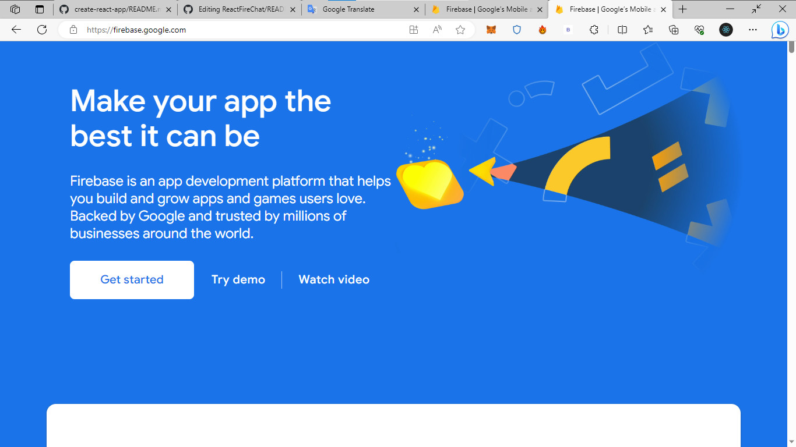
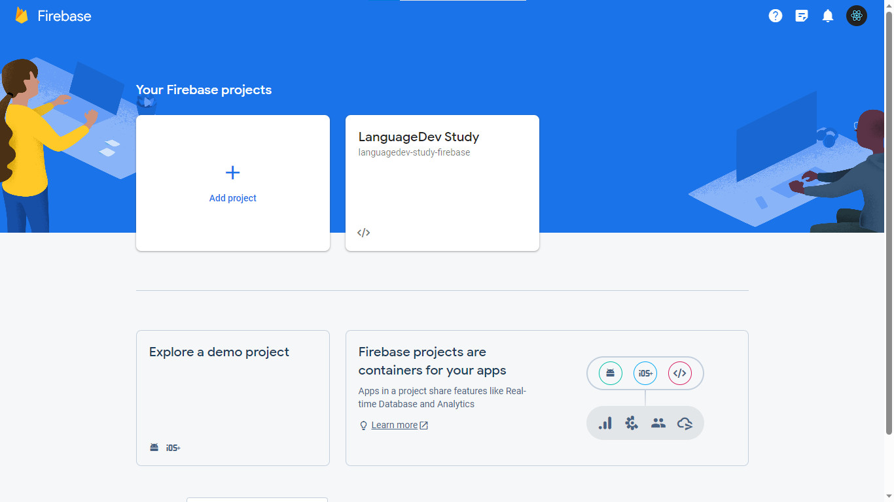
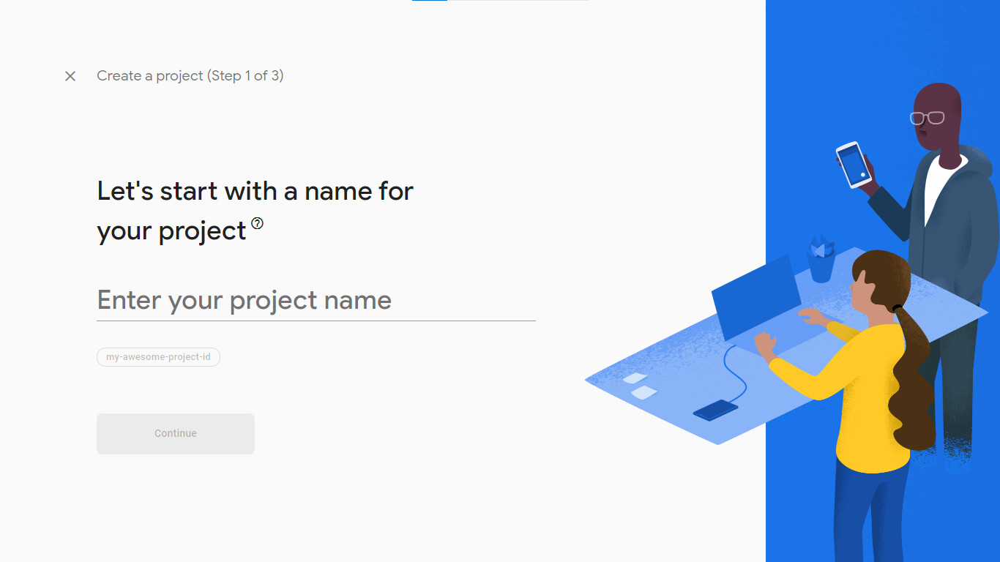
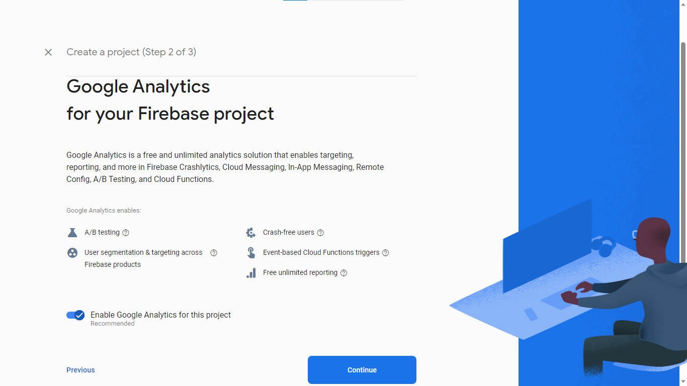
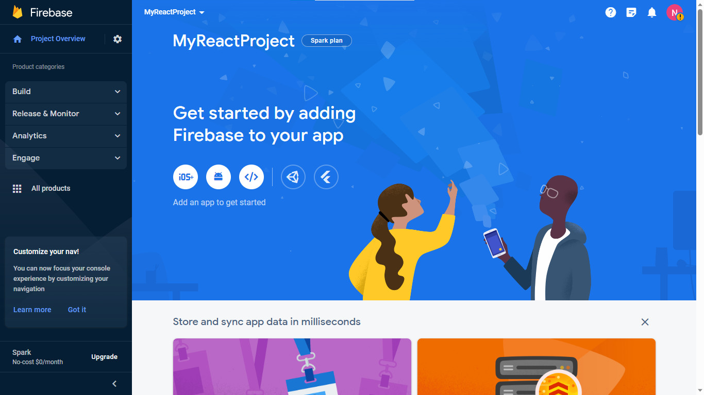
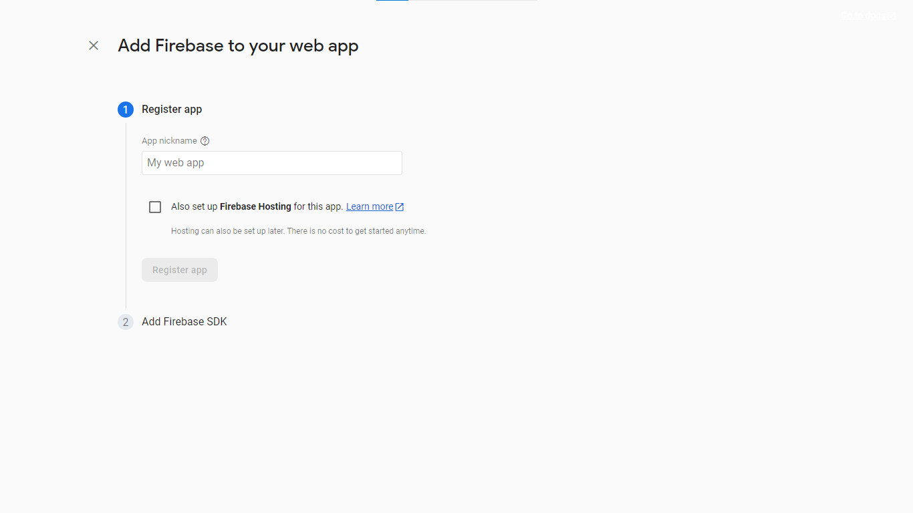

# ReactFireChat (Create-React-App x Firebase)

[](https://app.netlify.com/sites/reactfirechat-test/deploys) [](https://code.visualstudio.com/) [](https://www.javascript.com/) [](https://https://npmjs.com/)  [](https://microsoft.com/windows/)

This project was bootstrapped with [Create React App](https://github.com/facebook/create-react-app).

You can use it through three websites: [ReactFireChat (Offical Website)](https://reactfirechat.languagedevstudy.com), [ReactFireChat (Netlify)](https://reactfirechat-test.netlify.app) and [ReactFireChat (Cloudflare Pages)](https://reactfirechat.pages.dev)

## How to use?

You can use this React application directly by [clicking here](https://reactfirechat-test.netlify.app)

Or if you want to edit this project then you can do the following:

```sh
git clone -b clone-branch https://github.com/thaiminhnguyen1999/ReactFireChat
cd ReactFireChat
npm i
```

And if you want to run the React app then just enter the command:

```sh
npm start
```

## Project Structure

```
ReactFireChat
├── README.md
├── LICENSE
├── package.json
├── package-lock.json
├── node_modules
├── public
│   ├── img
│   ├── favicon.ico
│   ├── index.html
|   ├── logo192.png
|   ├── logo512.png
|   ├── manifest.json
│   └── robots.txt
└── src
    ├── App.css
    ├── App.js
    ├── App.test.js
    ├── index.css
    ├── index.js
    ├── logo.svg
    |── reportWebVitals.js
    └── setupTests.js
```

## Firebase
The project uses Firebase. So before running the `npm start` command add the Firebase project configuration first.

### How to add Firebase project configuration?

First, visit the website firebase.google.com.



Then press the `Get Started` button and you will be taken to another page.



Select `Add Project` then enter a name for your Firebase Project and press `Continue`.



Google will ask if you want to add Google Analytics to your Firebase project? In my opinion, it can be turned on but can't be turned on, so I don't turn it on (If not, click the button to the left of the word `Enable Google Analytics for this project`) and press `Continue`



Now wait a bit for Firebase to create the project. After complete, press `Continue`


Click the `</>` icon to continue.



Now enter the app name in `My web app` and press `Register app`



Under `Add Firebase SDK`, copy the part inside 
```
const firebaseConfig = {
  
};
```
and paste the code inside the file [ReactFireChat/src/App.js (Line 12).](https://github.com/thaiminhnguyen1999/ReactFireChat/blob/clone-branch/src/App.js)

Finally, save the file and you can use it.
